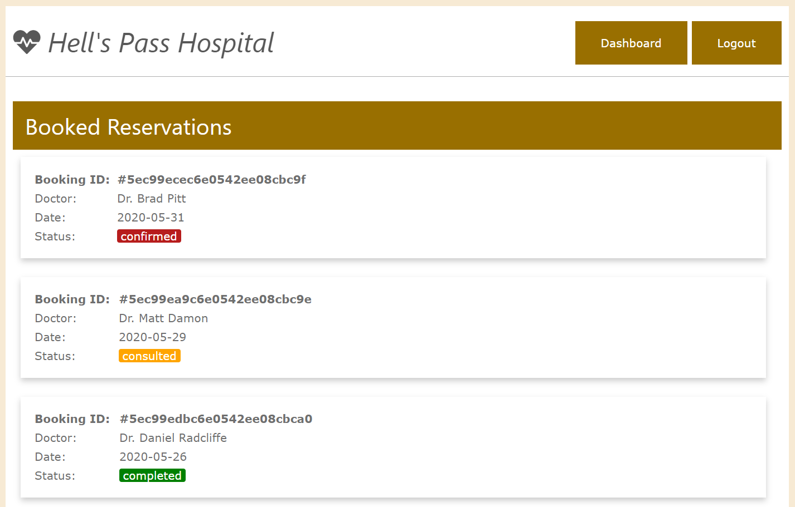

## Hell's Pass Hospital (Stevens Institute of Technology CS546A Final Project)
</img>
  
A Hospital Managment System which provides patient and doctor a convenient way to access to hospital services

#### Demo video:
[https://youtu.be/OQdMMBOkNhg](https://youtu.be/OQdMMBOkNhg)

## How to Use:
1. Install project's dependencies in base folder: `npm install`

2. Seeding MongoDB database: `npm run seed`

3. Start the project: `npm start`

4. Go to `http://localhost:3000/` in your browser

** Please refer to the following files for sample login data:
1. `task/Sample_Account_Doctors`
2. `task/Sample_Account_Patients`

## Features
#### For Patients:
* Signup / Login
* Update profile
* Change password
* Doctor appointment booking
* Prescription checkout
#### For Doctors:
* Login: Login system will determine the login informaiton belongs to doctor or patient
* Signup
* Update profile
* Change password
* Make prescription
* Update prescription

## Project Structure
* Front-end  
`./view`
* Server  
`./routes`
* Database  
`./data`

## Group members:
* Shih-Hao Lo
* Hao-Ping Lin
* Naman Yadav
* Yoseph Borai
* Alessandro Gangemi
